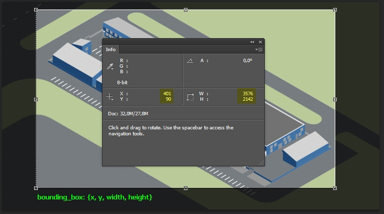

# C80MapFloors

The gem adds interactive map (with floors) to a site.

## Installation

Add this line to your host app's Gemfile:

```ruby
    gem 'historyjs-rails'
    gem 'bootstrap-sass', '~> 3.3.4'
    gem 'bootstrap-select-rails'
    gem 'c80_map_floors'
```

Host app's `application.js.coffee` requires:

```
    #= require c80_map_floors
```

Add this to `application.scss`:

```
    @import "c80_map_floors";
```

Add this to host app's `application_controller.rb`:

```
    helper C80MapFloors::Engine.helpers
```

Add this to `routes.rb`:

```
    mount C80MapFloors::Engine => '/'
```

# Configure

Migrate:

```
   $ mi
```   

Use seeds:

```
    $ rake db:seed:c80_map_floors_01_fill_map_settings
```

Create `public/locations.json`:

```
{
  "mapwidth": "3000",
  "mapheight": "1558",
  "img": "/uploads/map/none.jpg"
}
```

## Start

Create in host app's assets\javascripts:

```js
$(document).ready(function() {
    if ($('#map_wrapper').length) {
        InitMap({
            dnd_enable:false,
            debug: true,
            left_padding: 50,
            right_padding: 50,
            focus_area_width: 500,
            focus_area_height: 500,
            bounding_box: {
                x: 401,
                y: 90,
                width: 3576,
                height: 2142
            }
        });
    }
});
```

Focus area:


Bounding box:



# Helpers
```
    render_map
```
